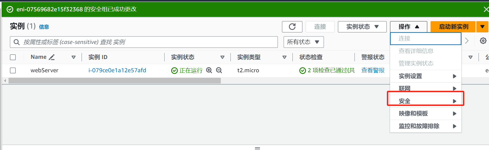

# dataVisWeb -- 基于flask的MySQL数据可视化

目前路由分为三部分
```
|-- / ： 该部分将添加数据来源选项或者添加登录功能
|-- main: 总览数据，包括售出总额、最新，最晚售出时间
|-- shoe: 具体鞋类的细节
```

# docker 部署
请修改config.py的url确保docker能连接到mysql

```shell
# 通过pyreqs获取requirements
pyreq . 
docker build -t ${image_name} .
# 进去修改config.py 
docker run -it -p 5000:5000 --name ${container-name} ${image-name} /bin/bash 
# 云服务器实例
sudo docker run -it -p 5000:5000 -v /home/ec2-user/code/stockxWeb/:/app --name stockxServer -d webserver /bin/bash
```

## TODO 1. docker连接宿主机mysql


## 2. aws开启安全组
1. 在安全组开放端口
2. 在实例版面应用安全组

